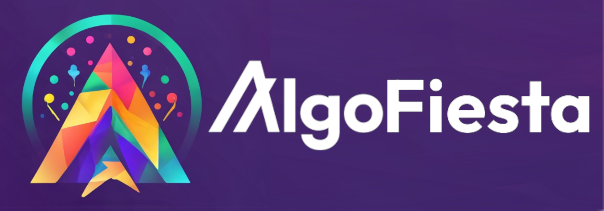
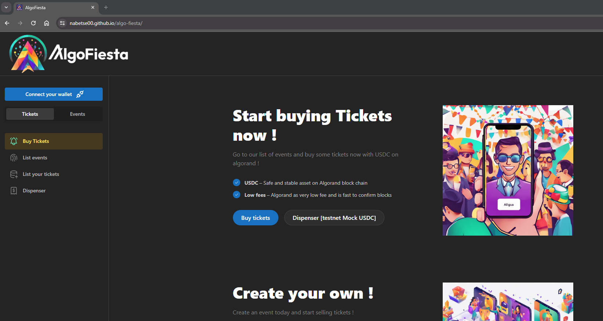
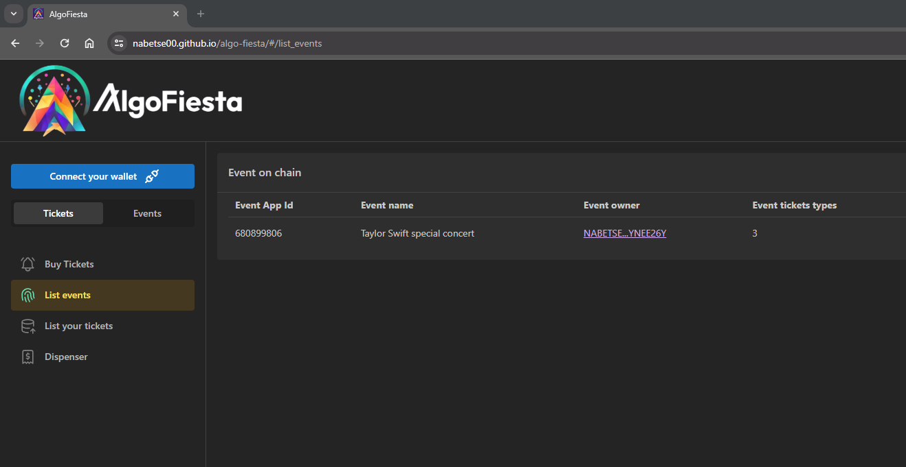
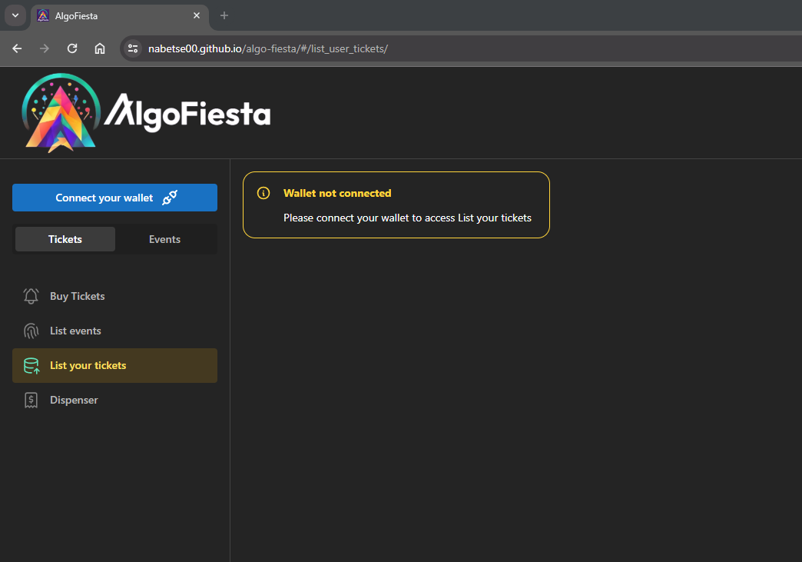
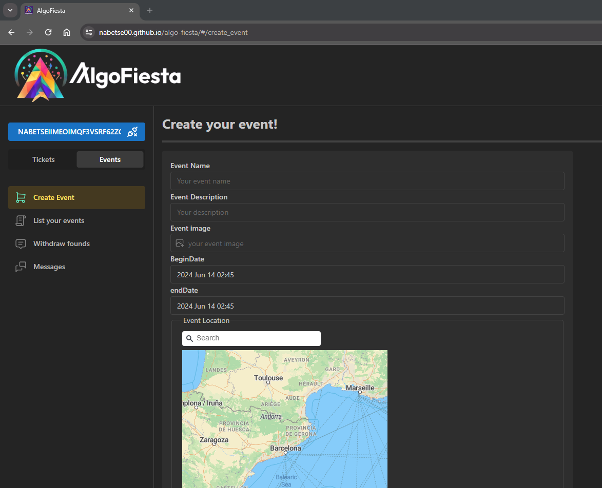
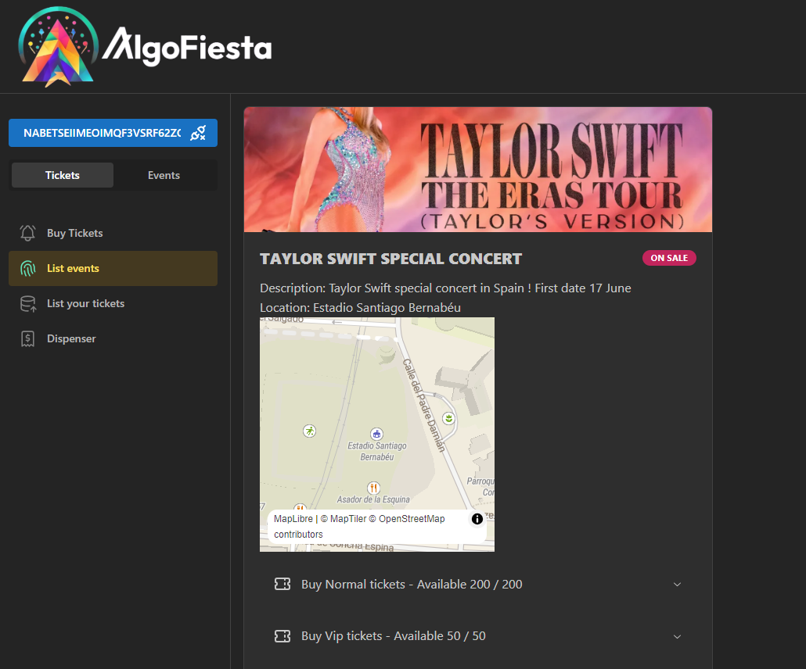

# AlgoFiesta



*Empowering Events on the Blockchain*

AlgoFiesta is a decentralized application built on the Algorand blockchain, providing a seamless platform for creating, managing, and attending events. 

Leveraging the power of blockchain technology, AlgoFiesta ensures secure, transparent, and efficient transactions for event organizers and participants.

## Features
- **Event Creation:** Easily create events with detailed descriptions, dates, locations, and ticket prices.
- **Event Management:** Manage and edit event details, monitor ticket sales, and interact with attendees.
- **Ticket Sales:** Securely sell tickets using Algorand's fast and low-cost transactions.
- **Decentralized & Transparent:** All transactions and event details are recorded on the Algorand blockchain, ensuring transparency and immutability.

## Getting Started
Prerequisites
To use AlgoFiesta, you need:

- An Algorand wallet (e.g. Pera Wallet)
- A minimum amount of ALGO tokens for transaction fees 
on testnet you can use [dispenser](https://bank.testnet.algorand.network/)
- algokit install, if you use localnet


## Installation

### Clone the repository:

```bash
git clone https://github.com/nabetse00/algo-fiesta
cd algo-fiesta/project/frontend-app
```
### Install dependencies:

```bash
npm install
```

### Set up env variables
Copy [.env.template](./projects/frontend-app/.env.template) to `.env` and fill missing values.
```toml
VITE_GEOMAP_API_KEY=xxxx
VITE_WALLET_CONNECT_ID=xxxx
VITE_PINATA_API_KEY=xxxx
VITE_PINATA_API_SECRET=xxxx
VITE_PINATA_JWT=xxxx
```
### Start the development server:

```bash
npm run dev  
```
Open your browser and navigate to http://localhost:5173/algo-fiesta/ to use AlgoFiesta locally.

## Live Demo app

Go to https://nabetse00.github.io/algo-fiesta/ to test a live demo.











## Contracts

### Sources

Contract sources are in [./projects/algo-fiesta/smart_contracts/](./projects/algo-fiesta/smart_contracts/)

- [Event Factory](./projects/algo-fiesta/smart_contracts/event_factory/)
Event Factory deploys a new Event Manager for your event
- [Event Manager](./projects/algo-fiesta/smart_contracts/event_manager//)
Event Manager sells and manages tickets for your event
- [Mock USDCa](./projects/algo-fiesta/smart_contracts/usdca_mock/)
Mock USDCa Asa token to buy testnet Tickets 

Contracts are writen in puya python.
See https://github.com/algorandfoundation/puya for documentation

### Contracts live on testnet

- Event Factory: https://testnet.explorer.perawallet.app/application/680738089/
- Mock USDCa dispenser: https://testnet.explorer.perawallet.app/application/680738109/
- Mock USDCa Asa: https://testnet.explorer.perawallet.app/asset/680738127/

## Video demos

[Short demo](https://youtu.be/ovxvIGQbRzk)

[Long demo](https://youtu.be/-xsNqTcNFnQ)